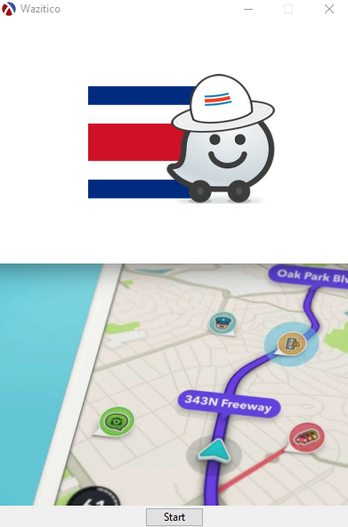
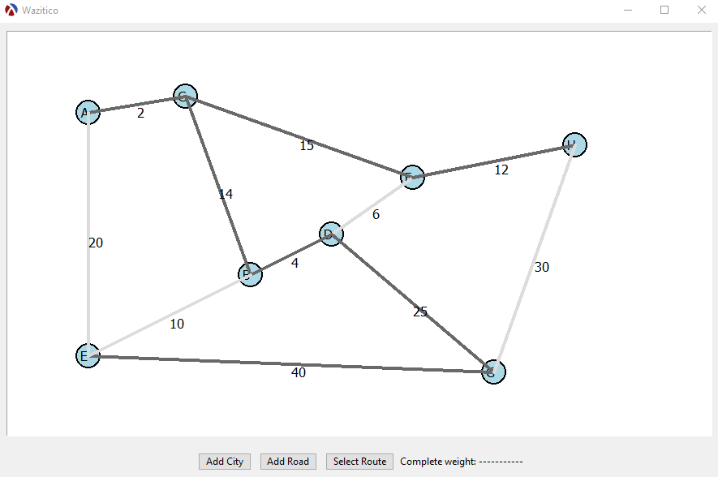
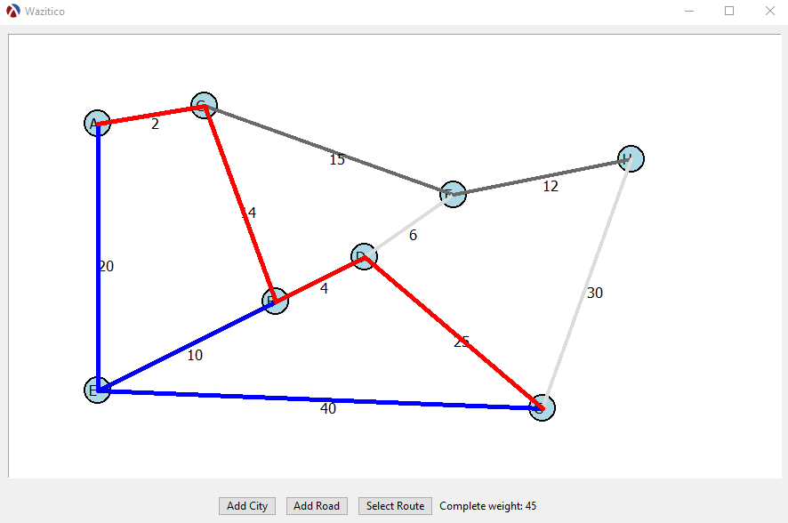

# Wazitico

<h1 align="center">
  <br>
  <a href=""></a>
  <br>
  <br>
</h1>

<h4 align="center">
        Simulation of the famous "Waze" assisted navigation application, 
        using a mixed graph with weights developed in the Racket programming language.
</h4>

<p align="center">
  <a href="#installation">Installation</a> •
  <a href="#how-to-use">How to use?</a> •
  <a href="#authors">Authors</a> •
</p>


 
 Welcome Window             | Main Window               | PathFinder                |
 :-------------------------:|:-------------------------:|:-------------------------:|
  | | |
 
 

## Installation

#### Download the GitHub repo
Prerequisites: You must have [Git](https://git-scm.com/book/es/v2/Inicio---Sobre-el-Control-de-Versiones-Instalaci%C3%B3n-de-Git) 
    installed on your console and also [DrRacket](https://download.racket-lang.org)

1. On GitHub, go to the main page of the [repository](https://github.com/ErickCR12/Wazitico).
2. Under the name of the repository, click Clone or download.
3. In the Clone with HTTPs section, click to copy the repository cloning URL.
4. Open Git Bash.
5. Change the current working directory to the location where you want the cloned directory to be made.
6. Type 'git clone', and then paste the URL that you copied in Step 2.

   ```$ git clone https://github.com/ErickCR12/Wazitico```
   
7. Press Enter. Your local clone will be created for [Wazitico](https://github.com/ErickCR12/Wazitico).
8. Open DrRacket, select: `File` ->` Open File or Project` and go to the location where you cloned the project.
9. Click on `src/main.rkt` to run the project.


## How to use?
The program is very easy and friendly to use
1. You start by creating some cities in the `Add City` button, you type the name of the city
and the (X, Y) coordinates you wanna place it.
2. Then you start to make connections between the cities using the `Add Road` button, this let 
you decide witch cities to connect, how far they are from each other and if is a two way road or 
just one way.
3. When your Map is ready you can `Select Route` to find all possible paths from one city to another
and the shorter one mark as red, the total distance of this path is displayed in the 
`Complete weight: ` label.
4. To clear the current route just press `Select Route` again.
5. You can add as many cities and roads as you want in the `500x870` canvas.


## Authors
* **Jose Acuña Solano** - *developer and ux designer* - [JoDaniel1412](https://github.com/JoDaniel1412)
* **María José Zamora Vargas** - *developer and ux designer* - [mjosezam](https://github.com/mjosezam)
* **Erick Barrantes Cerdas** - *developer and ux designer* - [ErickCR12](https://github.com/ErickCR12)
